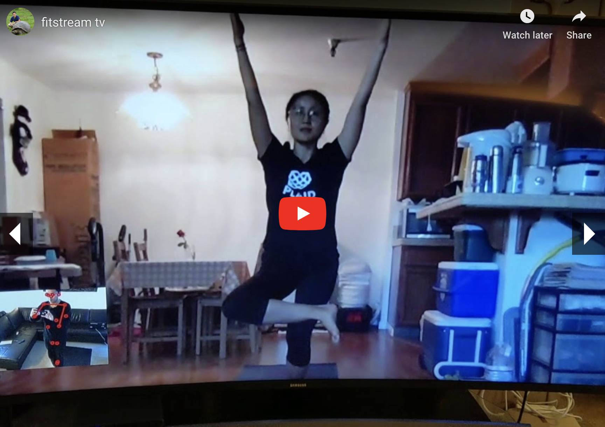
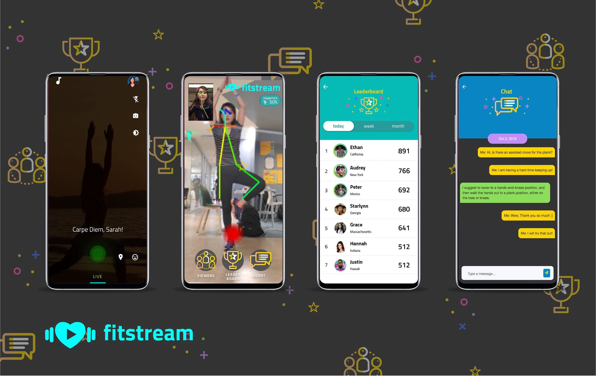

# Tell us what your idea is
Streaming platform for fitness professionals, yoga teachers, dance instructors.  Using Tensorflow Posenet to see and communicate it’s postures with users.  Users who watch the stream now can try to do the same poses, and when they are slacking or incapable of doing the moves, the instructor would know it right away through feedback system.

# Tell us how you plan on bringing it to life 
We’ve originally built this idea for a hackathon, and afterwards we received a lot of demands from both friends and yoga teachers that want to push this app alive.  We have a rough prototype on both html/javascript and Android TV.  Android Phone becomes a perfect device for streamers to stream their yoga/fitness class, and Android TV is a good platform for users to consume the content in the comfort of their own home.

We currently have a functioning prototype, the streaming platform is using tokbox, and Android device is currently running a web/javascript version, and Android TV is running fritz.ai.  The instructors can stream into the phone and users can watch it on TV.  Android TV demo can be seen at https://www.youtube.com/watch?v=beycoumTbbs and Android Device demo can be seen at https://www.youtube.com/watch?v=mYzjiz_NV1Y

## TV App

## Android App

Our plans for the next few month is listed as following

1. Finish Tensorflow Posenet for Android by December 31st, this would give us much needed app for public demo.
2. Finish Android TV App sometime in Mid Feburary.
3. Sign up at least 100 yoga teachers before April, this way when we launch the application, there will be instructors ready to teach at any time of the day.

Very first and foremost we need posenet example in Java from Google if possible, currently it’s written in kotlin.  All the WebRTC is currently written in Java, making kotlin integration extremely difficult.  For the quick prototype we choose to use alternatives that can get it done faster.  We will also be needing help on reinforcement learning to do more than just Posenet.

# Tell us about you
A great idea is just one part of the equation; we also want to learn a bit more about you. Share with us some of your other projects so we can get an idea of how we can assist you with your project. 

Peter Ma is a full stack engineer, Android developer and AI expert.  He has previously involved in 5 different startups and won more than 100 hackathons in the past.  Some of his accomplishments include speaking about mobile apps at TEDGlobal 2010, Winning 2015 AT&T Developer Summit grand prize and gave Secretary of State John Kerry and Vice Premier Liu Yandong of China, Winning Grand Prize at Virtual GovTech Tech and awarded by deputy prime minister his highness Mansoor of Dubai.  Some of his AI works includes BlueScan AI, an AI for skin cancer and Clean Water AI, a device that uses AI and microscopic cameras for water contamination.  

Peter have previously worked on Android app for Catch Notes, Spotvite, Frienduel, Oncue Video app for Verizon, Calorie Count for about.com, and many other apps for both startup and his clients.

I will be working on this full time, but there will be others that will help me part time
Serena Xu is a yoga instructor, who has previously worked in many technology startups
Ethan Fan is an iOS/Android developer who is Co-Founder at Vimo Labs, he has over 10 years of app experience in fitness app industry.
Sarah Han is a designer who lives in Los Angeles whom have won at least 50+ hackathons with me in the past.

We’ve worked together a lot in the past.
